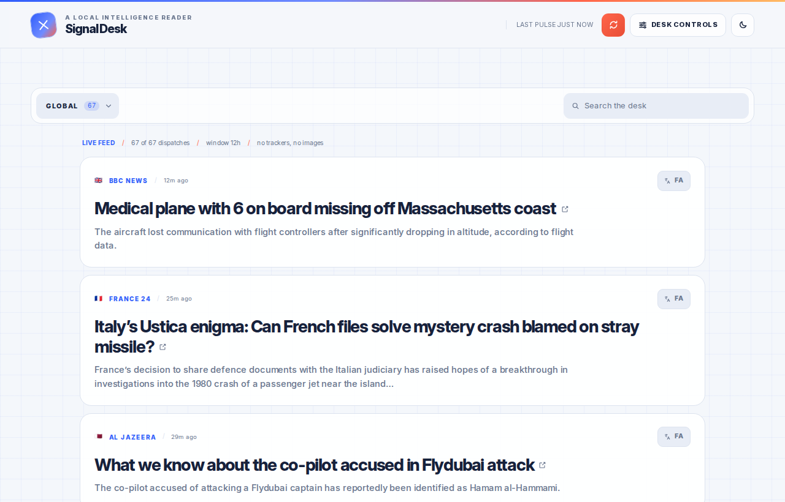
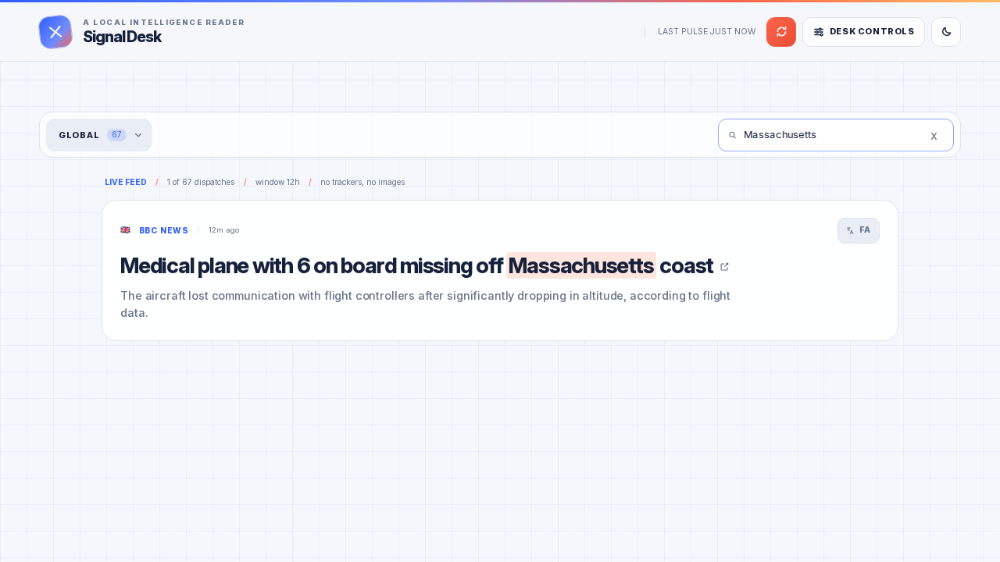
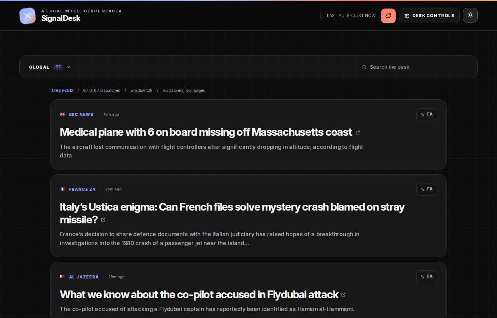
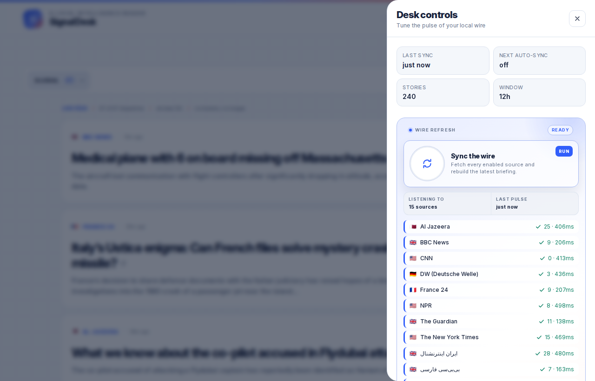
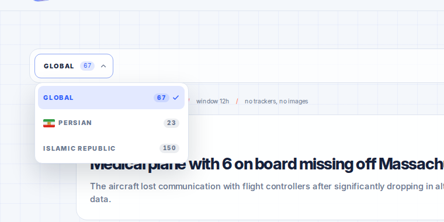
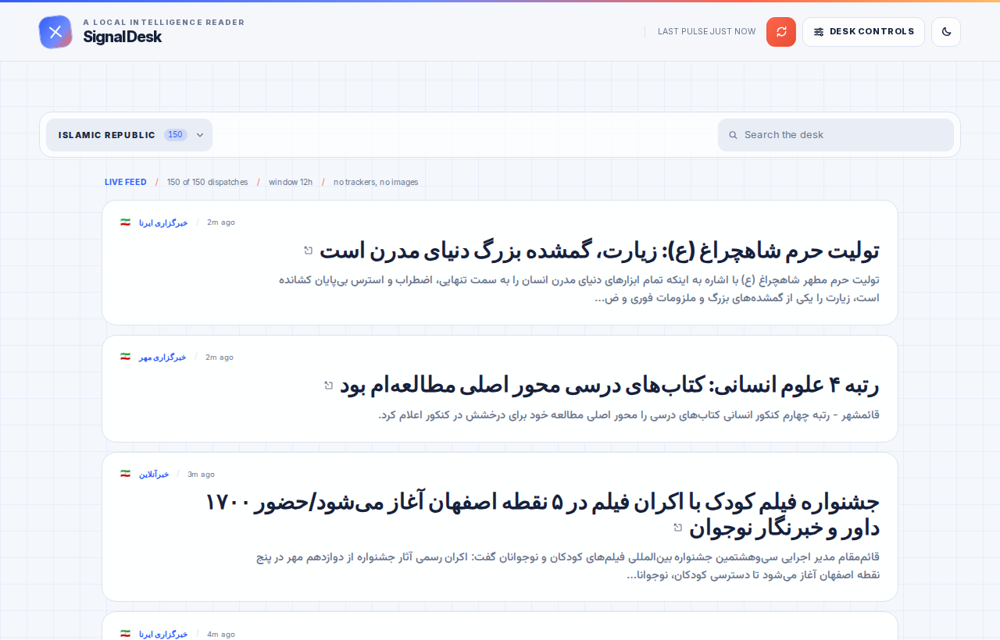

# NewsHub · Signal Desk

**A local-first news desk for global affairs & Iranian geopolitics.** 15 RSS/Atom
sources → one tracker-free JSON digest, served by a single Next.js app.


## Preview

| Live desk | Search + highlight |
| --- | --- |
|  |  |
| **Dark theme** | **Desk controls** |
|  |  |
| **Desk menu** | **Iranian desk** |
|  |  |

## What it does

- **Three desks, one feed** — Global (8 sources), Persian diaspora (2), Iran (5);
  switch with the desk dropdown, counts animate per desk.
- **Rolling window** — only stories newer than 6/12/24/48h are kept (default 12h);
  stale items retire automatically.
- **Live search** — filters titles, summaries and sources on every keystroke and
  highlights matches; `x` clears.
- **EN → FA translation** — per-story `FA`/`EN` toggle (Google GTX, MyMemory
  fallback, 600-entry local cache); Persian desks render RTL natively.
- **Desk controls panel** — time window, auto-sync interval (Off…12h), per-source
  on/off switches, save/reset, plus live per-source results after each sync.
- **Manual sync with progress** — NDJSON stream drives a progress ring, per-source
  rows (`✓ 25 items · 406ms`) and toasts. Shortcut: `R`.
- **Auto-refresh scheduler** — server-side loop, off by default in the shipped
  settings, reschedules after every settings change.
- **Tracker-free** — no CDN, no remote images, no analytics; fonts and the
  lion-and-sun flag are bundled, favicon is a `data:` URI.
- **Light/dark theme** — default light, `class="dark"` swap, persisted in
  `localStorage`.
- **Cheap by design** — single-file digest (`data/news.json`), ETag/304 on
  `GET /api/news`, 30 cards per page with lazy pagination.

## Quick start

```bash
npm ci
npm run build     # runs the feed fetch first (needs internet), then next build
npm start         # http://localhost:3000
```

Other scripts: `npm run dev` (Turbopack dev server), `npm run news` (re-pull feeds
only), `npm run typecheck`. Requires Node >= 20.18.

## Controls

| Input | Action |
| --- | --- |
| `R` | sync the wire now |
| `Esc` | close the desk-controls panel |
| `↑` / `↓` in the desk menu | move between desks |
| Search box | live filter + highlight |

## API

| Method | Route | Purpose |
| --- | --- | --- |
| `GET` | `/api/news` | digest JSON (ETag / 304) |
| `POST` | `/api/news/refresh` | single-flight resync, streams NDJSON events |
| `GET` | `/api/settings` | settings + source registry |
| `PATCH` | `/api/settings` | `windowHours` (1–48), `autoRefreshMinutes`, `maxItems`, `sources` |
| `POST` | `/api/translate` | `{"texts": [...]}` → Persian (1–5 texts) |
| `GET` | `/api/health` | node version, uptime, story count |

## Layout

```
src/app/        pages + API routes
src/server/     newsService · refreshManager · scheduler · store
src/components/ Header · ControlPanel · RegionSelect · NewsCard …
src/lib/        sources.json (15 feeds) · highlight · api · types
data/           settings.json (tracked) · news.json (generated, gitignored)
```
